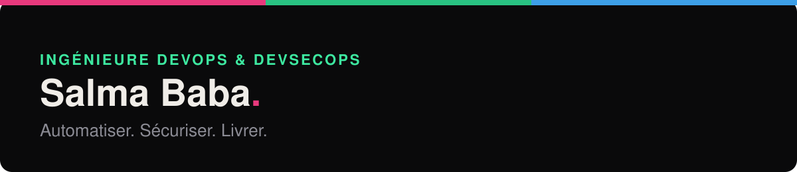

  

  
  
  

### Ingénieure DevOps & DevSecOps · Automatisation Python · CI/CD sécurisée · DataOps

Ingénieure informatique diplômée de **Polytech Marseille** (2026), avec **trois ans d'alternance
au CEA Cadarache** sur le système d'information d'un laboratoire en environnement nucléaire
réglementé : pipelines GitLab CI, migration de données vers PostgreSQL en Python, application de
traçabilité en C#/.NET sous accréditation COFRAC.

Un stage de recherche à l'**Université de Montréal** sur la sécurité des chaînes de build (SBOM,
scan de vulnérabilités, diversité logicielle) m'a orientée vers le **DevSecOps**.

Je cherche un **CDI d'ingénieure DevOps / DevSecOps** en région PACA (Aix-Marseille),
disponible dès maintenant.

**Ce qui me fait avancer** : un esprit innovant et la curiosité. Je m'intéresse de près à
**l'IA générative**, que j'utilise au quotidien pour prototyper, automatiser et apprendre plus
vite, en gardant un regard critique sur ce qu'elle produit. J'aime chercher des solutions
**créatives** à des problèmes concrets, et je crois à l'**amélioration continue** : mesurer,
optimiser, recommencer, dans le code comme dans l'infrastructure.

English version of my portfolio: [salmababa.com/en](https://salmababa.com/en)

---

## Projets à la une

| Projet | En bref | Technologies |
|---|---|---|
| **[Software Diversity](https://github.com/Salma2002ba/software-diversity-build-security)** | Recherche à Montréal : comparer les builds Maven et Gradle pour repérer une chaîne de build compromise | SBOM · Syft · Grype · GitHub Actions |
| **[Cloud Chat on AWS](https://github.com/Salma2002ba/cloud-chat-aws)** | Chat temps réel en microservices, déployé sur AWS par Terraform, pipeline DevSecOps | AWS · Terraform · Docker · ECS Fargate · Lambda |
| **[SECOMO](https://github.com/Salma2002ba/secomo)** | Serre connectée industrialisée : Ansible, Jenkins, Kubernetes, monitoring et logs | Kubernetes · Jenkins · Ansible · Prometheus · Grafana · Loki |
| **[SlimAI](https://github.com/Salma2002ba/SlimAI-CHAT)** | Chatbot qui cite ses sources : RAG sur base documentaire, clé du LLM gardée côté serveur | FastAPI · RAG · Gemini · PostgreSQL · React |

Chaque dépôt a son pipeline CI avec des contrôles de sécurité (secrets, dépendances, images,
infrastructure as code).

---

## Boîte à outils

**Au quotidien**

  
  
  
  
  
  
  
  
  

**DevSecOps**

  
  
  
  
  

**En montée en compétences, à travers mes projets**

  
  
  
  
  
  
  

---

## Parcours

- **2023 – 2026** · Ingénieure Logiciel & DevOps (alternance), **CEA Cadarache**
- **2025** · Stagiaire recherche en cybersécurité et DevSecOps, **Université de Montréal**
- **2026** · Diplôme d'ingénieure en informatique, **Polytech Marseille**

**Langues** : français · anglais professionnel · arabe
